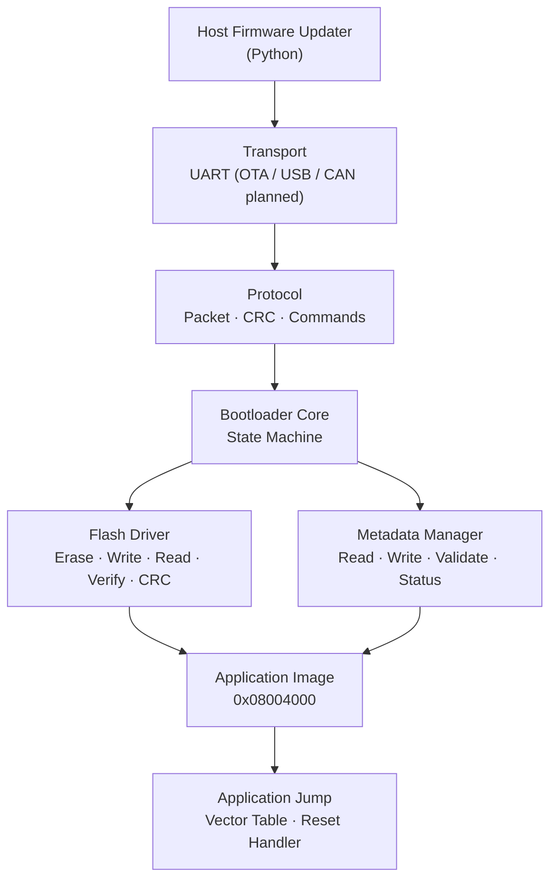
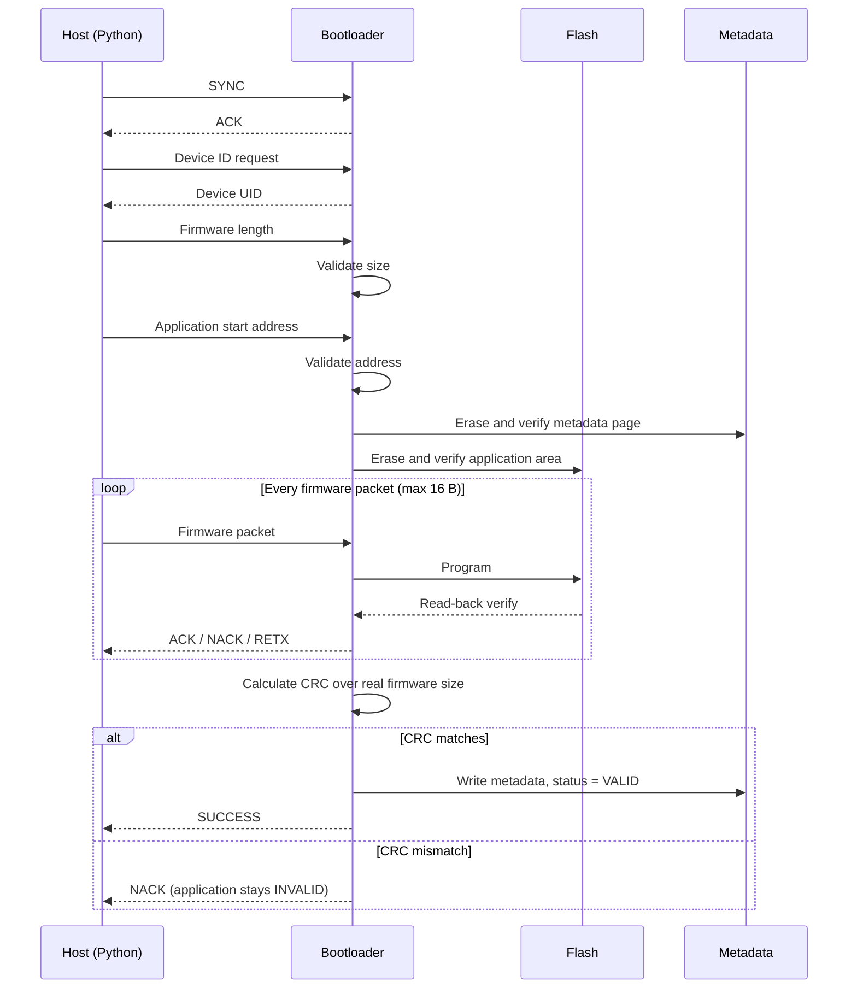
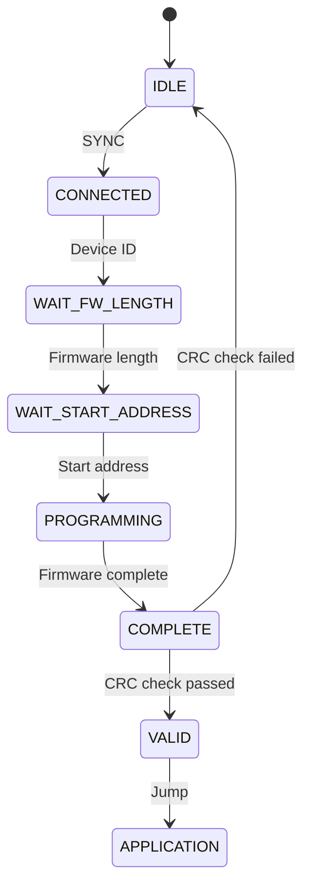
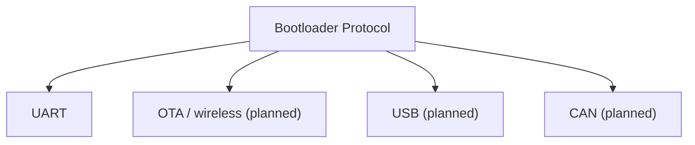

<div align="center">

# STM32 Bootloader

**A modular, verifiable firmware bootloader for STM32G4 with a transport-independent, OTA-ready design, part of the [G4_Core_Lib](https://github.com/shohanur00/G4_Core_Lib) framework.**


</div>

---

## Table of Contents

- [Overview](#overview)
- [OTA Update Support](#ota-update-support)
- [Key Features](#key-features)
- [Design Principles](#design-principles)
- [Target Platform](#target-platform)
- [Flash Memory Map](#flash-memory-map)
- [Architecture](#architecture)
- [Directory Structure](#directory-structure)
- [Firmware Update Flow](#firmware-update-flow)
- [Bootloader State Machine](#bootloader-state-machine)
- [Communication Protocol](#communication-protocol)
- [Flash Driver](#flash-driver)
- [Firmware Metadata](#firmware-metadata)
- [CRC Verification](#crc-verification)
- [Application Jump](#application-jump)
- [Host Firmware Updater](#host-firmware-updater)
- [Error Handling](#error-handling)
- [Build Configuration](#build-configuration)
- [Project Status](#project-status)
- [Roadmap](#roadmap)
- [Author](#author)

---

## Overview

This bootloader provides a complete, safe firmware update path for STM32 microcontrollers. Transport, protocol, flash handling, metadata, and application-jump logic live in separate modules so each can be reused or replaced independently (for example, swapping UART for USB or CAN later).

> **A firmware image is never considered valid until it has been completely programmed and successfully verified.**

## OTA Update Support

The bootloader is built so that firmware can be updated **over the air (OTA)** without changing the core update logic. The protocol, state machine, flash driver, and metadata handling know nothing about the physical link; they only exchange packets through the transport layer.

- **Today:** firmware is delivered over **UART** by the Python host updater.
- **OTA path:** a wireless link (for example a Wi-Fi / BLE / LoRa module or gateway) acts as a new `transport` implementation that forwards the same packets to the bootloader.
- **Safe by design:** the same checks protect an OTA update as a wired one: size and address validation, flash read-back, CRC-16 verification, and the metadata `VALID` flag, so an interrupted wireless transfer never leaves a half-written image marked valid.

> **Status:** OTA transport is **planned** and not yet implemented. See the [Roadmap](#roadmap).

## Key Features

- Packet-based protocol with CRC protection, ACK / NACK and retransmission
- Firmware size and application address validation before any erase
- Page-based flash erase with erase verification
- Flash programming with read-back verification
- Whole-image CRC-16 verification
- Dedicated metadata page that marks the application `VALID` only after a successful update
- Bootloader region protection against accidental writes
- Application validity check and jump with vector table handoff
- Retry and packet-recovery handling for transient communication errors
- Transport-independent core, ready to be extended to OTA updates
- Python host firmware updater
- Bare-metal / CMSIS code, no STM32CubeMX required

## Design Principles

| # | Principle | Description |
|---|-----------|-------------|
| 1 | **Never trust unverified firmware** | Valid = programmed + flash-verified + CRC-verified + metadata-validated |
| 2 | **Protect the bootloader** | Updates can never write into `0x08000000 – 0x08003FFF` |
| 3 | **Separate responsibilities** | Transport → Protocol → Bootloader core → Flash / Metadata / Jump |
| 4 | **Verify critical operations** | Erase → check erased, Write → read back, Image → CRC |
| 5 | **Fail safely** | On any failure the application is not marked valid and the bootloader stays available for another attempt |

## Target Platform

| Parameter | Value |
|-----------|-------|
| MCU | STM32G431CBT6 |
| CPU | ARM Cortex-M4 |
| Flash | 128 KB |
| Flash page size | 2 KB |
| Bootloader region | 16 KB |
| Application region | 108 KB |
| Metadata region | 2 KB |
| Application data region | 2 KB |
| IDE | VS Code |
| Build system | CMake + Ninja |
| Compiler | ARM GNU Toolchain |
| Framework | CMSIS / bare-metal (CubeMX not required) |

## Flash Memory Map

| Region | Start | End | Size | Purpose |
|--------|-------|-----|------|---------|
| Bootloader | `0x08000000` | `0x08003FFF` | 16 KB | Bootloader code (protected) |
| Application | `0x08004000` | `0x0801EFFF` | 108 KB | User firmware |
| Metadata | `0x0801F000` | `0x0801F7FF` | 2 KB | Firmware info and validity status |
| Application Data | `0x0801F800` | `0x0801FFFF` | 2 KB | Persistent application data |

<details>
<summary><b>Memory configuration macros</b></summary>

```c
#define BL_FLASH_START_ADDRESS          (0x08000000UL)
#define BL_FLASH_SIZE                   (128UL * 1024UL)
#define BL_FLASH_PAGE_SIZE              (2UL * 1024UL)
#define BL_FLASH_END_ADDRESS            (BL_FLASH_START_ADDRESS + BL_FLASH_SIZE - 1UL)

#define BL_BOOTLOADER_START_ADDRESS     (0x08000000UL)
#define BL_BOOTLOADER_SIZE              (16UL * 1024UL)
#define BL_BOOTLOADER_END_ADDRESS       (BL_BOOTLOADER_START_ADDRESS + BL_BOOTLOADER_SIZE - 1UL)

#define BL_APP_START_ADDRESS            (0x08004000UL)
#define BL_APP_SIZE                     (108UL * 1024UL)
#define BL_APP_END_ADDRESS              (BL_APP_START_ADDRESS + BL_APP_SIZE - 1UL)

#define BL_METADATA_START_ADDRESS       (0x0801F000UL)
#define BL_METADATA_SIZE                (2UL * 1024UL)
#define BL_METADATA_END_ADDRESS         (BL_METADATA_START_ADDRESS + BL_METADATA_SIZE - 1UL)

#define BL_APP_DATA_START_ADDRESS       (0x0801F800UL)
#define BL_APP_DATA_SIZE                (2UL * 1024UL)
#define BL_APP_DATA_END_ADDRESS         (BL_APP_DATA_START_ADDRESS + BL_APP_DATA_SIZE - 1UL)
```

</details>

## Architecture



## Directory Structure

```text
Bootloader/
├── app/
│   ├── bootloader_app.c / .h      # Setup, loop, deinit lifecycle
├── bootloader/
│   ├── bootloader.c / .h          # Core state machine
├── config/
│   ├── bl_config.h
│   └── bl_flash_config.h          # Memory map and flash configuration
├── flash/
│   ├── bl_flash.c / .h            # Erase, write, read, verify, CRC
├── metadata/
│   ├── bl_metadata.c / .h         # Firmware metadata management
├── jump/
│   ├── bl_jump.c / .h             # Application validation and jump
├── protocol/
│   ├── bl_protocol.c / .h         # Packet framing, CRC, commands
└── transport/
    └── bl_transport.c / .h        # Physical transport (UART)
```

**Application lifecycle API**

```c
void Bootloader_App_Setup(void);
void Bootloader_App_Loop(void);
void Bootloader_App_Deinit(void);
```

`Setup` initializes the bootloader, transport, protocol, and flash, then `Loop` runs the update state machine.

## Firmware Update Flow



**Packet padding.** The last firmware packet may be smaller than the physical flash programming unit. The remainder is padded with `0xFF`, while the real firmware size is stored separately so the CRC covers only the actual image.

```text
Firmware data :  AA BB CC DD EE FF
Flash write   :  AA BB CC DD EE FF FF FF
```

## Bootloader State Machine



## Communication Protocol

### Packet format

```text
┌──────┬────────┬───────┬───────────────┬──────────┐
│ SOF  │ LENGTH │  CMD  │ DATA          │ CRC      │
├──────┼────────┼───────┼───────────────┼──────────┤
│ 1 B  │ 1 B    │ 1 B   │ 0-16 Bytes    │ 2 B      │
└──────┴────────┴───────┴───────────────┴──────────┘
```

| Field | Size | Description |
|-------|------|-------------|
| `SOF` | 1 byte | Start of frame, `0xA5` |
| `LENGTH` | 1 byte | Length of the `DATA` field |
| `CMD` | 1 byte | Command identifier |
| `DATA` | 0 to 16 bytes | Command-specific payload |
| `CRC` | 2 bytes | Packet CRC |

```c
#define BL_PROTOCOL_SOF              (0xA5U)
#define BL_PROTOCOL_MAX_DATA_SIZE    (16U)
```

Illustrative example (Firmware Request with 4 data bytes):

```text
A5  04  31  12 34 56 78  <CRC16>
SOF LEN CMD     DATA       CRC
```

### Commands

| Command | Value | Description |
|---------|-------|-------------|
| `SYNC` | `0x20` | Synchronize with bootloader |
| `FW REQUEST` | `0x31` | Firmware request |
| `FW RESPONSE` | `0x37` | Firmware response |
| `DEVICE ID REQUEST` | `0x3C` | Request MCU device ID |
| `DEVICE ID RESPONSE` | `0x3F` | Device ID response |
| `FW LENGTH REQUEST` | `0x42` | Firmware length request |
| `FW LENGTH RESPONSE` | `0x45` | Firmware length response |
| `READY` | `0x48` | Ready for firmware |
| `SUCCESS` | `0x54` | Firmware update successful |
| `ACK` | `0x15` | Positive acknowledgement |
| `NACK` | `0x59` | Negative acknowledgement |
| `RETX` | `0x19` | Retransmission request |

### Device identification

The bootloader reports the STM32 unique device identifier so the host updater can confirm it is talking to the intended device.

### Retry handling

On a recoverable error the bootloader answers `NACK` or `RETX`, restores the saved context, and reprocesses the retransmitted packet, so a transient communication fault does not force the whole update to restart.

## Flash Driver

```c
bool     BL_Flash_Init(void);

bool     BL_Flash_Erase(uint32_t address, uint32_t length);
bool     BL_Flash_Write(uint32_t address, const uint8_t *data, uint32_t length);
bool     BL_Flash_Read(uint32_t address, uint8_t *data, uint32_t length);
bool     BL_Flash_Verify(uint32_t address, const uint8_t *data, uint32_t length);
bool     BL_Flash_IsErased(uint32_t address, uint32_t length);

/* Metadata-region variants */
bool     BL_Flash_Erase_MetaData(uint32_t address, uint32_t length);
bool     BL_Flash_Write_MetaData(uint32_t address, const uint8_t *data, uint32_t length);
bool     BL_Flash_Read_MetaData(uint32_t address, uint8_t *data, uint32_t length);
bool     BL_Flash_Verify_MetaData(uint32_t address, const uint8_t *data, uint32_t length);
bool     BL_Flash_IsErased_MetaData(uint32_t address, uint32_t length);

uint16_t BL_Flash_CalculateCRC(uint32_t address, uint32_t length);
```

**Range protection.** Every operation validates its address range first. Application programming is only allowed in `0x08004000 – 0x0801EFFF`; the bootloader, metadata, and application-data regions are dedicated and protected from firmware writes.

## Firmware Metadata

Metadata lives in its own flash page and records whether the application is trustworthy.

```c
typedef struct
{
    uint32_t magic;
    uint32_t start_address;
    uint32_t size;
    uint16_t crc;
    uint16_t version;
    uint32_t update_status;
    uint32_t reserved[3];
} BL_FirmwareMetadata_t;
```

| Field | Description |
|-------|-------------|
| `magic` | Identifies a valid metadata structure |
| `start_address` | Application start address |
| `size` | Firmware image size |
| `crc` | Expected firmware CRC |
| `version` | Firmware version |
| `update_status` | Firmware validity state |
| `reserved` | Reserved for future use |

```c
#define BL_FIRMWARE_METADATA_MAGIC   (0x424C4D44UL)
#define BL_UPDATE_STATUS_INVALID     (0x00000000UL)
#define BL_UPDATE_STATUS_VALID       (0xA5A5A5A5UL)
```

```c
bool BL_Metadata_Save(const BL_FirmwareMetadata_t *metadata);
bool BL_Metadata_Read(BL_FirmwareMetadata_t *metadata);
bool BL_Metadata_IsValid(const BL_FirmwareMetadata_t *metadata);
```

**Lifecycle:** at the start of an update the metadata is erased (status `INVALID`). It is only rewritten with status `VALID` after programming, flash read-back, and CRC check all pass, so an interrupted update can never leave a half-written image marked valid.

## CRC Verification

Firmware integrity uses **CRC-16-CCITT-FALSE**, computed over the real firmware size only (not the `0xFF` padding).

```c
#define BL_FLASH_CRC16_POLYNOMIAL    (0x1021U)
#define BL_FLASH_CRC16_INITIAL       (0xFFFFU)
```

## Application Jump

```c
uint8_t BL_Jump_IsApplicationValid(void);
void    BL_Jump_ToApplication(void);
```

Before jumping, the bootloader validates the application:

1. Read firmware metadata
2. Check metadata magic
3. Check update status is `VALID`
4. Validate application address and size
5. Calculate and compare application CRC

On success, execution is transferred to the application's initial stack pointer and reset handler located at `0x08004000`.

**Application requirement.** The application must be linked with its flash origin at `0x08004000` and its vector table must be located at the same address, matching the memory map above.

## Host Firmware Updater

A Python host tool drives the update from the PC side and has been used to test the full update flow. It:

- reads `firmware.bin` and calculates its size and CRC
- builds packets and sends commands
- handles `ACK` / `NACK` / `RETX` and retries
- monitors update status until `SUCCESS`

## Error Handling

The bootloader is designed to fail safely. Detected failure conditions include:

- Invalid SOF, packet length, or packet CRC
- Invalid firmware size or application address
- Flash erase, programming, or verification failure
- Metadata write failure
- Firmware CRC mismatch
- Invalid metadata or application validation failure

In every case the firmware is **not** marked `VALID`, a `NACK` / error is returned, and the update can be retried or restarted.

## Build Configuration

The project uses CMake presets for the different build targets.

| Setting | Value |
|---------|-------|
| Preset | `Debug-Bootloader` |
| Build type | `Debug` |
| Build target | `BOOTLOADER` |
| `BOOTLOADER` | `1U` |
| Flash origin | `0x08000000` |
| Flash length | `16K` |

Example configure output:

```text
-- Build Type      : Debug
-- Build Target    : BOOTLOADER
-- BOOTLOADER      : 1U
-- FLASH ORIGIN    : 0x08000000
-- FLASH LENGTH    : 16K
```

## Project Status

| Feature | Status |
|---------|--------|
| Bootloader application layer and state machine | ✅ Implemented |
| UART transport and protocol | ✅ Implemented |
| Device UID handling | ✅ Implemented |
| Firmware size and address validation | ✅ Implemented |
| Flash erase / program / read / verify / erased-check | ✅ Implemented |
| CRC-16-CCITT-FALSE | ✅ Implemented |
| Firmware metadata (read / write) | ✅ Implemented |
| Retry handling | ✅ Implemented |
| Application jump | ✅ Implemented |
| Host firmware updater | ✅ Implemented and tested |
| Full application validation | ✅ Implemented  |
| Power-loss / interrupted-update testing | 🔄 In development |
| OTA (wireless) firmware update | 📋 Planned |
| USB transport | 📋 Planned |
| CAN transport | 📋 Planned |
| Firmware authentication | 📋 Planned |
| Secure boot | 📋 Planned |

## Roadmap

- [ ] Power-loss / interrupted-update testing
- [ ] OTA (wireless) firmware update transport
- [ ] USB firmware transport
- [ ] CAN firmware transport
- [ ] Firmware authentication
- [ ] Secure boot support
- [ ] Firmware version management
- [ ] Boot attempt / rollback mechanism
- [ ] Additional host-side tooling

Because the protocol and core are independent of the physical layer, new transports only need a new `transport` implementation:



## Author

**Engr. Shohanur Rahman**
Embedded Software Engineer · Firmware · PCB Hardware · Motor Control · Power Electronics

[](https://github.com/shohanur00)
[](https://www.linkedin.com/in/engr-shohanur-rahman-181a69250/)

---

<div align="center">

*Program it, verify it, validate it, then trust it.*

Copyright © 2026 Engr. Shohanur Rahman. Part of the personal development work of the author.

</div>
