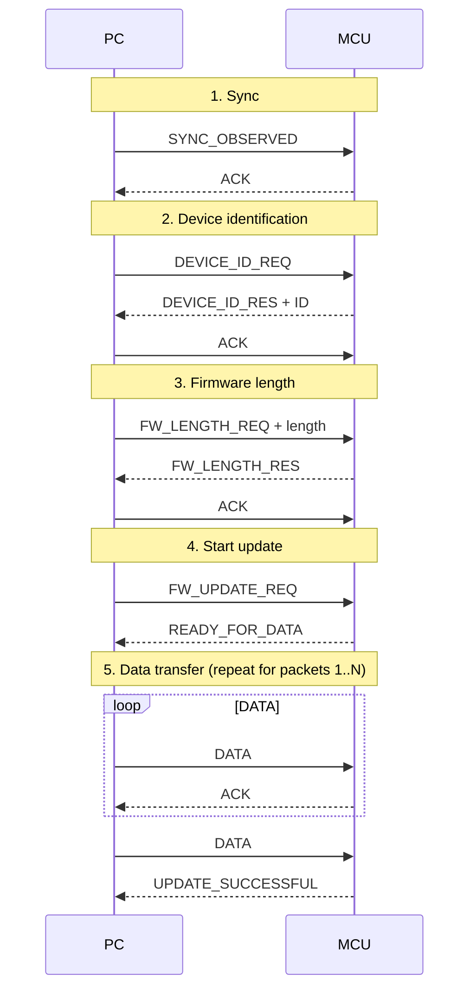

# Bootloader Firmware Update Protocol

Host (PC) ⇄ Target (MCU) handshake and firmware transfer flow.

## Sequence Diagram



## ASCII Version

```
PC                                      MCU
│                                        │
│──── SYNC_OBSERVED ───────────────────>│
│<──── ACK ─────────────────────────────│
│                                        │
│──── DEVICE_ID_REQ ───────────────────>│
│<──── DEVICE_ID_RES + ID ──────────────│
│──── ACK ─────────────────────────────>│
│                                        │
│──── FW_LENGTH_REQ + length ──────────>│
│<──── FW_LENGTH_RES ───────────────────│
│──── ACK ─────────────────────────────>│
│                                        │
│──── FW_UPDATE_REQ ───────────────────>│
│<──── READY_FOR_DATA ──────────────────│
│                                        │
│──── DATA #1 ─────────────────────────>│
│<──── ACK ─────────────────────────────│
│──── DATA #2 ─────────────────────────>│
│<──── ACK ─────────────────────────────│
│                 ...                    │
│──── DATA #N ─────────────────────────>│
│<──── UPDATE_SUCCESSFUL ───────────────│
```

## Message Summary

| # | Phase | Message | Direction | Payload | Expected reply |
|---|-------|---------|-----------|---------|----------------|
| 1 | Sync | `SYNC_OBSERVED` | PC → MCU | — | `ACK` |
| 2 | Identify | `DEVICE_ID_REQ` | PC → MCU | — | `DEVICE_ID_RES` |
| 3 | Identify | `DEVICE_ID_RES` | MCU → PC | Device ID | `ACK` |
| 4 | Length | `FW_LENGTH_REQ` | PC → MCU | Firmware length | `FW_LENGTH_RES` |
| 5 | Length | `FW_LENGTH_RES` | MCU → PC | — | `ACK` |
| 6 | Start | `FW_UPDATE_REQ` | PC → MCU | — | `READY_FOR_DATA` |
| 7 | Transfer | `DATA #1 … #N-1` | PC → MCU | Firmware chunk | `ACK` per packet |
| 8 | Finish | `DATA #N` | PC → MCU | Last chunk | `UPDATE_SUCCESSFUL` |

## Notes

- The final data packet is answered with `UPDATE_SUCCESSFUL` instead of a plain `ACK`.
- Opcodes, packet framing, chunk size, CRC/checksum and timeout/retry behaviour are not defined in this diagram — add them here once fixed in the firmware.
