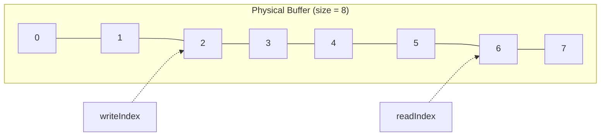

<div align="center">

# Ring Buffer

**Static-memory, power-of-two circular buffer for embedded C**


</div>

Designed for resource-constrained embedded systems where dynamic memory allocation is avoided.

## Contents

- [Features](#features)
- [Directory structure](#directory-structure)
- [Design](#design)
- [Power-of-two sizing](#power-of-two-sizing)
- [Usable capacity](#usable-capacity)
- [API](#api)
- [Bulk operations](#bulk-operations)
- [Zero-copy access](#zero-copy-access)
- [Search](#search)
- [Example](#example)
- [Typical applications](#typical-applications)
- [Memory model](#memory-model)
- [Design notes](#design-notes)
- [Future extensions](#future-extensions)

## Features

- Static memory allocation — no `malloc()` / `free()`
- Power-of-two buffer size, fast index wrapping via bitwise AND
- Single-byte and bulk read / write
- Peek without removing data
- Discard without copying
- Zero-copy access through `RingBuffer_PeekBuffer()`
- Byte search (`RingBuffer_Find`)
- Reset and status APIs
- Hardware-independent — reusable as a Common-layer module, unit-testable on a PC

## Directory structure

```text
Common/
└── Containers/
    └── RingBuffer/
        ├── ring_buffer.h
        └── ring_buffer.c
```

> [!NOTE]
> The module has no dependency on STM32 or any other MCU-specific hardware.

## Design

Two indices track the buffer:



- `readIndex` points to the oldest unread byte.
- `writeIndex` points to the next position where new data will be written.
- The buffer wraps around when an index reaches the end.

## Power-of-two sizing

The physical buffer size must be a power of two (`8, 16, 32, 64, 128, 256, ...`). This lets wrapping use a bitmask instead of modulo:

```c
mask  = size - 1;              // size = 8  →  mask = 0b0111
index = (index + 1U) & mask;   // equivalent to index % size, cheaper on MCU
```

For a power-of-two `N`: `x & (N - 1) == x % N`.

## Usable capacity

This implementation uses the **one-slot-empty convention**: for a physical buffer of `N` bytes, usable capacity is `N - 1`.

One slot stays empty so that `readIndex == writeIndex` unambiguously means *empty*; the full condition is `nextWriteIndex == readIndex`.

| Physical buffer | Usable capacity |
|---|---|
| 8 bytes | 7 bytes |

## API

### Initialization

```c
void RingBuffer_Setup(RingBuffer_t *rb, uint8_t *buffer, uint32_t size);
```
Initializes a ring buffer using caller-provided storage. `size` must be a power of two, minimum 2.

```c
uint8_t buffer[128];
RingBuffer_t rb;
RingBuffer_Setup(&rb, buffer, sizeof(buffer));
```

```c
void RingBuffer_Reset(RingBuffer_t *rb);
```
Resets read/write positions. Contents are not erased.

### Status

| Function | Returns |
|---|---|
| `bool RingBuffer_Empty(const RingBuffer_t *rb)` | `true` when no data is available |
| `bool RingBuffer_Full(const RingBuffer_t *rb)` | `true` when no additional byte can be written |
| `uint32_t RingBuffer_Capacity(const RingBuffer_t *rb)` | usable capacity (`N - 1`) |
| `uint32_t RingBuffer_Count(const RingBuffer_t *rb)` | unread bytes currently stored, via `(writeIndex - readIndex) & mask` |
| `uint32_t RingBuffer_Free(const RingBuffer_t *rb)` | `Capacity - Count` |

Example — `Count()` handles wraparound correctly:

```text
readIndex  = 6
writeIndex = 2
Logical data: 6 → 7 → 0 → 1
Count = 4
```

### Single-byte operations

```c
bool RingBuffer_Write(RingBuffer_t *rb, uint8_t byte);
```
Writes one byte. Returns `false` if the buffer is full.

```c
bool RingBuffer_Read(RingBuffer_t *rb, uint8_t *byte);
```
Reads and removes the oldest byte.

```c
bool RingBuffer_Peek(const RingBuffer_t *rb, uint8_t *byte);
```
Reads the oldest byte **without** advancing `readIndex`.

```c
bool RingBuffer_Discard(RingBuffer_t *rb);
```
Advances past the oldest byte without copying it out — data stays in RAM, only `readIndex` moves.

```text
Read()    → get data + remove
Peek()    → get data + keep
Discard() → remove without getting
```

## Bulk operations

```c
uint32_t RingBuffer_WriteBuffer(RingBuffer_t *rb, const uint8_t *data, uint32_t length);
```
Writes up to `length` bytes; returns the number actually written (may be fewer if there isn't enough free space).

```c
uint32_t RingBuffer_ReadBuffer(RingBuffer_t *rb, uint8_t *data, uint32_t length);
```
Reads up to `length` bytes; returns the number actually read.

```c
uint32_t RingBuffer_DiscardBuffer(RingBuffer_t *rb, uint32_t length);
```
Removes multiple bytes without copying them out.

## Zero-copy access

```c
const uint8_t *RingBuffer_PeekBuffer(const RingBuffer_t *rb, uint32_t *length);
```
Returns a direct pointer to the first **contiguous** readable region, avoiding a copy.

```c
const uint8_t *data;
uint32_t length;

data = RingBuffer_PeekBuffer(&rb, &length);
if (length > 0U) {
    ProcessData(data, length);
    RingBuffer_DiscardBuffer(&rb, length);
}
```

> [!IMPORTANT]
> When data wraps around the end of the physical buffer, it can exist in **two separate regions**. `RingBuffer_PeekBuffer()` returns only the first contiguous region — call it again after discarding to reach the second.

```text
Buffer:
┌───┬───┬───┬───┬───┬───┬───┬───┐
│ A │ B │ C │ D │ E │ F │ G │ H │
└───┴───┴───┴───┴───┴───┴───┴───┘
                    ↑           ↑
                 readIndex    writeIndex

readIndex = 6, writeIndex = 2  →  logical data: G H A B (split into "G H" and "A B")
```

## Search

```c
bool RingBuffer_Find(const RingBuffer_t *rb, uint8_t value, uint32_t *offset);
```
Searches unread data for a byte; `offset` is relative to `readIndex`. Non-destructive.

```text
Data: A B C D E
Find 'D' → offset = 3
```

## Example

```c
#include <stdint.h>
#include "ring_buffer.h"

int main(void)
{
    uint8_t buffer[8];
    uint8_t byte;
    RingBuffer_t rb;

    RingBuffer_Setup(&rb, buffer, sizeof(buffer));

    RingBuffer_Write(&rb, 'A');
    RingBuffer_Write(&rb, 'B');
    RingBuffer_Write(&rb, 'C');

    if (RingBuffer_Read(&rb, &byte)) {
        /* byte == 'A' */
    }

    return 0;
}
```

## Typical applications


- UART RX/TX buffering
- Serial protocol parsing
- USB data buffering
- CAN message processing
- DMA data buffering
- Command-line interfaces
- Logger backends
- Sensor data streams
- Packet parsing
- Producer/consumer systems

## Memory model

No dynamic allocation — the caller owns the storage:

```c
uint8_t uartRxBuffer[128];
RingBuffer_t uartRx;
RingBuffer_Setup(&uartRx, uartRxBuffer, sizeof(uartRxBuffer));
```

Memory usage = user-provided data buffer + the `RingBuffer_t` control structure. No heap required.

## Design notes

**Hardware independent** — no dependency on STM32, HAL, CMSIS, UART, DMA, or an RTOS, so it's reusable across MCUs and platforms.

**Power-of-two requirement** — wrapping uses `index & mask`, so buffer size must be a power of two (`8, 16, 32, ...`, not `10, 20, 50, 100`). For arbitrary sizes, use modulo-based wrapping instead.

> [!WARNING]
> **Thread / ISR safety** — not synchronized for arbitrary concurrent access. Intended for single-producer / single-consumer use (e.g. ISR/DMA writes, main loop reads); additional care around atomic access, memory ordering, and interrupt behavior may be needed depending on the MCU.

## Future extensions

<details>
<summary>Click to expand</summary>

- Overwrite mode
- SPSC lock-free support
- ISR-safe API
- DMA-friendly two-segment API
- Generic element-size support
- Optimized bulk copy using `memcpy()`
- Full-capacity mode without one-slot reservation
- PC unit-test suite
- Protocol-oriented helpers

</details>

---

<div align="center">

See the project-level license for usage and distribution terms.

</div>