<div align="center">

# G4_Core_Lib

### A Modular Bare-Metal Firmware Foundation for STM32G4

**Embedded C · CMSIS · CMake · ARM GNU Toolchain · VS Code**

<br/>


<br/>

*Building reusable embedded firmware from the hardware layer up.*

</div>

---

## Table of Contents

- [Overview](#overview)
- [Highlights](#highlights)
- [Project Goals](#project-goals)
- [Architecture](#architecture)
- [Core Components](#core-components)
- [Bootloader](#bootloader)
- [Memory Layout](#memory-layout)
- [Host Tools](#host-tools)
- [Build System](#build-system)
- [Quick Start](#quick-start)
- [Project Structure](#project-structure)
- [Design Principles](#design-principles)
- [Development Environment](#development-environment)
- [Flash and Debug](#flash-and-debug)
- [Current Status](#current-status)
- [Roadmap](#roadmap)
- [Target Applications](#target-applications)
- [Author](#author)
- [License](#license)

---

## Overview

**G4_Core_Lib** is a reusable, modular, hardware-oriented firmware foundation for **STM32G4 microcontrollers**, built from the ground up with:

| | |
|---|---|
| **Language** | Embedded C |
| **Core / registers** | CMSIS |
| **Abstraction** | Custom lightweight HAL |
| **Build** | CMake + Ninja |
| **Toolchain** | ARM GNU Toolchain |
| **IDE / debug** | VS Code, SWD, Cortex-Debug |

The project does **not** depend on STM32CubeMX-generated application code. Its main objective is to keep firmware cleanly layered so it is easy to reuse, test, debug, extend, and adapt to future STM32 projects.

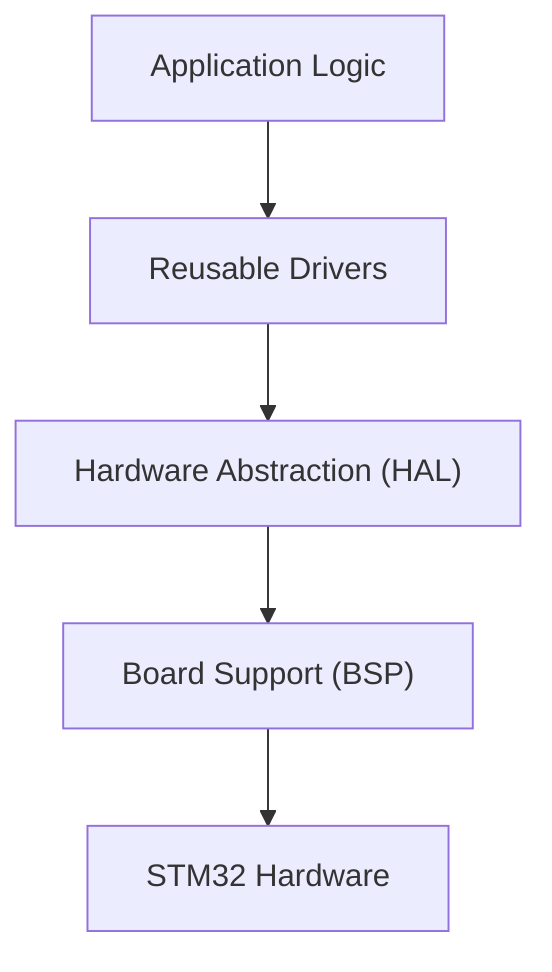

## Highlights

- 🧱 **Layered architecture**: Application → Driver API → HAL → BSP → CMSIS
- 🔌 **Reusable UART framework** with multi-instance support, interrupt reception, and ring buffers
- ⏱️ **TimeCore** software timing framework, independent of the timer peripheral
- 🪵 **Logger / debug service** decoupled from the UART implementation
- 💾 **Flash abstraction**: erase, program, read, verify, and CRC
- 🚀 **Modular STM32 bootloader** with metadata, CRC verification, retry handling, and application jump
- 🐍 **Python host updater** for firmware update testing
- 🔧 **One CMake project** that builds both Bootloader and Main application configurations

## Project Goals

G4_Core_Lib is being developed as more than a collection of peripheral drivers. The long-term goal is a reusable embedded software foundation covering:

| Area | Scope |
|------|-------|
| Abstraction | Hardware abstraction, peripheral drivers, board support |
| Services | System services, debug and logging |
| Storage | Flash management |
| Updates | Firmware update infrastructure, bootloader, application validation |
| Build | Modular build configurations |

It also serves as a development platform for experimenting with embedded firmware architecture, low-level STM32 development, and reusable software components.

---

## Architecture

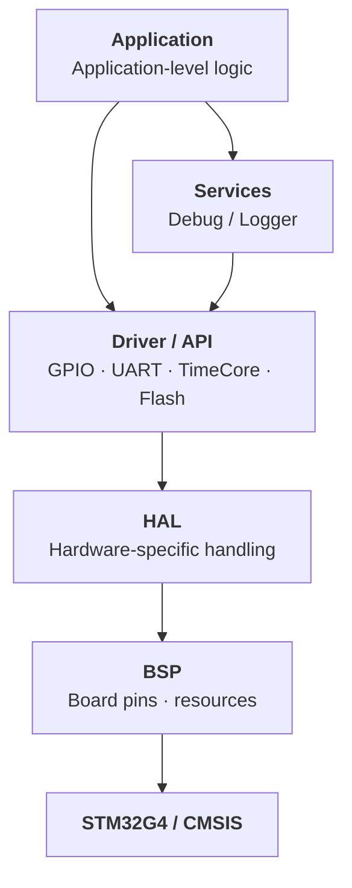

| Layer | Responsibility |
|-------|----------------|
| **Application** | System-level behavior. Avoids direct dependency on peripheral registers whenever a reusable API exists |
| **Driver / API** | Reusable interfaces for peripherals and system services (`GPIO`, `UART`, `TimeCore`, `Flash`, `SystemClock`) |
| **HAL** | Isolates MCU-specific implementation details |
| **BSP** | Board-specific resources and physical pin mappings (`LED`, `LOG_UART`, `BOOTLOADER_UART`) |
| **Services** | Cross-cutting functionality such as debug and logging |
| **CMSIS** | MCU core and register definitions |

---

## Core Components

### GPIO

Reusable GPIO interface with hardware-specific implementation isolated through the HAL. Applications work with logical GPIO resources without touching MCU registers.


### TimeCore

A lightweight software timing framework built around a hardware-independent API, so application modules can use software timers without depending on a specific timer peripheral. The current implementation is based on a periodic system time base.


### SystemClock

Centralized system clock initialization, kept separate so clock setup never mixes with application logic.

```text
Drivers/
└── systemclock/
    ├── systemclock.c
    └── systemclock.h
```

### UART Framework

A reusable UART framework designed around multiple instances:

`USART1` · `USART2` · `USART3` · `UART4` · `UART5` · `LPUART1`

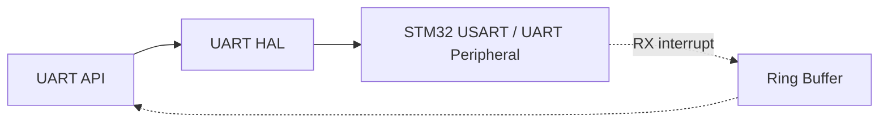

It supports interrupt-driven reception and ring-buffer based data handling, forming the foundation for debug logging, bootloader communication, command interfaces, and firmware update transport.

### Logger / Debug Service

Debug and logging live in `Services/Debug/`, separated from the application layer. The logger produces structured diagnostic messages without forcing application code to depend on UART details, and logging can be enabled or disabled through configuration instead of scattered conditional compilation.


### Flash Framework

A reusable abstraction for STM32 internal Flash, also used by the bootloader firmware update system. It isolates:

- Address validation
- Flash erase and programming
- Data verification and memory access
- CRC calculation
- Flash controller handling


---

## Bootloader

One of the major developments inside G4_Core_Lib is a reusable **STM32 firmware bootloader**, designed as a modular system rather than update logic buried in `main.c`.

> 📘 Full details: [`Bootloader/README.md`](Bootloader/README.md)

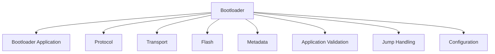

### Firmware update architecture

The update logic is independent of the physical transport, so the same protocol can be reused over different links.

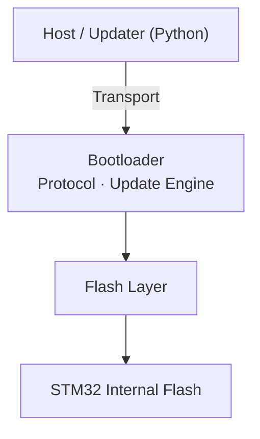

| Transport | Status |
|-----------|--------|
| UART | ✅ Working |
| USB | 📋 Planned |
| CAN | 📋 Planned |
| OTA (wireless) | 📋 Planned |

### Bootloader protocol

The bootloader uses a custom framed protocol with these characteristics:

| Property | Value |
|----------|-------|
| Start of frame (`SOF`) | `0xA5` |
| Maximum payload | 16 bytes |
| CRC | CRC-16-CCITT-FALSE |

Supported commands cover synchronization, device identification, firmware update request, firmware size, application start address, firmware data transfer, ACK, NACK, retransmission, update completion, and application validation. The protocol layer does not depend on UART, which keeps it reusable with other transports. See the [Bootloader README](Bootloader/README.md) for the exact packet layout and command table.

### Update state machine

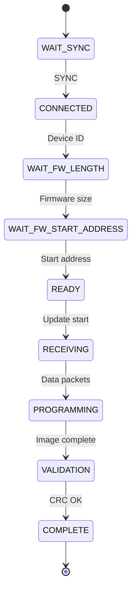

### Update sequence

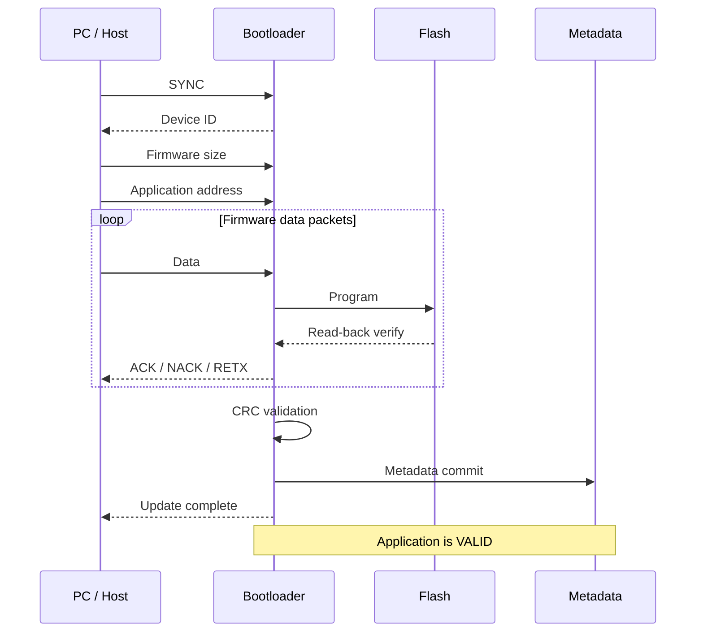

### Application validation

The bootloader does not rely on the mere existence of firmware in Flash. It checks firmware state and integrity before allowing execution, which is stronger than testing for non-`0xFF` data.

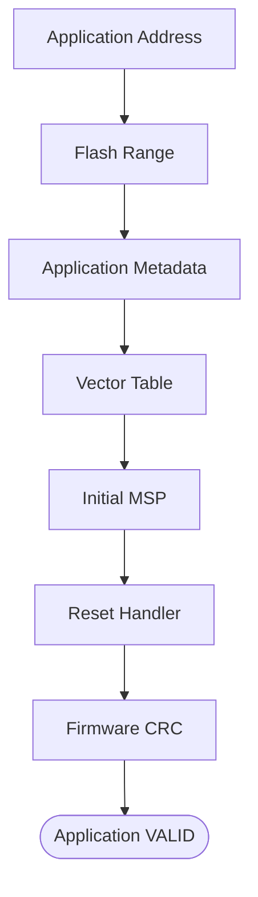

### Firmware metadata

Persistent metadata, stored separately from the application image, decides whether an installed firmware is valid. It holds:

`Magic` · `Start Address` · `Firmware Size` · `CRC` · `Version` · `Update Status` · `Reserved`

The bootloader trusts persistent metadata, not temporary runtime state.

### Application jump

After successful validation the bootloader hands execution to the application and handles the required Cortex-M state transition:

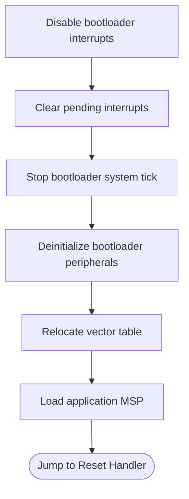

This keeps the application independent from the bootloader runtime environment.

---

## Memory Layout

For the current STM32G431 bootloader configuration, the 128 KB Flash is split into dedicated regions.

| Region | Start | End | Size |
|--------|-------|-----|------|
| Bootloader | `0x08000000` | `0x08003FFF` | 16 KB |
| Main Application | `0x08004000` | `0x0801EFFF` | 108 KB |
| Bootloader Metadata | `0x0801F000` | `0x0801F7FF` | 2 KB |
| Application Data / Reserved | `0x0801F800` | `0x0801FFFF` | 2 KB |

```text
STM32G431CBT6 · 128 KB Flash

0x08000000 ┌──────────────────────────────┐
           │         Bootloader           │
           │            16 KB             │
0x08004000 ├──────────────────────────────┤
           │       Main Application       │
           │            108 KB            │
0x0801F000 ├──────────────────────────────┤
           │     Bootloader Metadata      │
           │             2 KB             │
0x0801F800 ├──────────────────────────────┤
           │   Application Data /         │
           │   Reserved Region   2 KB     │
0x08020000 └──────────────────────────────┘
```

The exact memory configuration is controlled by the linker script (`stm32g431xb_flash.ld`) and the bootloader configuration.

---

## Host Tools

| Tool | Description | Status |
|------|-------------|--------|
| `firmware_update_test.py` | Command-line Python tool used to test the bootloader update flow | ✅ Working |
| [Universal Firmware Updater](https://github.com/shohanur00/Universal_Firmware_Updater) | A user-friendly PC application evolving from the command-line workflow | 🔄 In development |

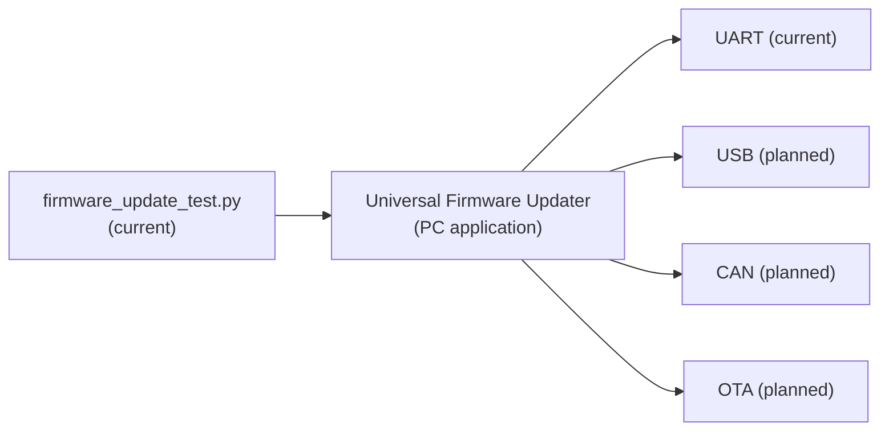

---

## Build System

The project uses **CMake + Ninja** with the ARM GNU Toolchain, organized as a single VS Code / CMake project where different firmware configurations are built from the same codebase.

| Preset | Purpose |
|--------|---------|
| `Debug` / `Release` | General builds |
| `Debug-Bootloader` / `Release-Bootloader` | Bootloader image, linked for the bootloader Flash region |
| `Debug-Main` / `Release-Main` | Main application image, linked for the application Flash region |

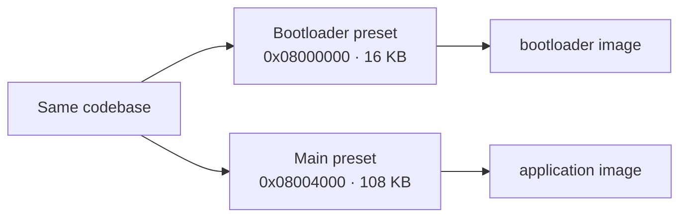

## Quick Start

**Prerequisites:** VS Code, ARM GNU Toolchain, CMake, Ninja, an ST-LINK (SWD) probe, and Python for the host updater.

```bash
git clone https://github.com/shohanur00/G4_Core_Lib.git
cd G4_Core_Lib

cmake --preset <preset>
cmake --build --preset <preset>
```

Use the exact preset names listed in `CMakePresets.json` (for example `Debug-Bootloader` or `Debug-Main`).

---

## Project Structure

```text
G4_Core_Lib/
│
├── App/                  # Application logic
├── BSP/                  # Board-specific resources
├── CMSIS/                # ARM / STM32 CMSIS files
├── Config/               # Project and board configuration
│
├── Drivers/
│   ├── GPIO
│   ├── UART
│   ├── Flash
│   ├── SystemClock
│   └── TimeCore
│
├── Services/
│   └── Debug/            # Debug / Logger services
│
├── Bootloader/
│   ├── Bootloader core
│   ├── Protocol
│   ├── Transport
│   ├── Flash
│   ├── Metadata
│   └── Application validation
│
├── Src/                  # Startup / system sources
├── Version/              # Project version information
├── cmake/                # CMake support files
├── .vscode/              # VS Code configuration
│
├── CMakeLists.txt
├── CMakePresets.json
├── STM32G431.svd
├── stm32g431xb_flash.ld
└── README.md
```

> The repository structure may evolve as additional reusable modules are introduced.

---

## Design Principles

| Principle | What it means |
|-----------|---------------|
| **Hardware abstraction** | Application code does not depend on MCU registers when a reusable abstraction fits |
| **Separation of concerns** | Application = behavior · Driver = reusable API · HAL = hardware implementation · BSP = board mapping · Services = cross-cutting functions · CMSIS = core and registers |
| **Reusability** | Modules are reusable across projects instead of tied to one application |
| **Encapsulation** | Register-level details stay behind well-defined interfaces (for example Application → Flash API → Flash implementation → Flash controller) |
| **Configuration driven** | Board and project configuration is centralized instead of scattering `#define` values and pin mappings through application code |

---

## Development Environment

| Tool | Purpose |
|------|---------|
| VS Code | Development environment |
| ARM GNU Toolchain | C/C++ compiler and linker |
| CMake | Build configuration |
| Ninja | Build execution |
| CMSIS | MCU / core register definitions |
| Cortex-Debug | Debugging |
| ST-LINK / SWD | Programming and debugging |
| STM32CubeProgrammer | Flash / programming utility |
| Python | Host-side firmware updater |

STM32CubeMX is **not required** for the project's peripheral abstraction architecture.

## Flash and Debug

The project is developed and debugged primarily through **SWD**.

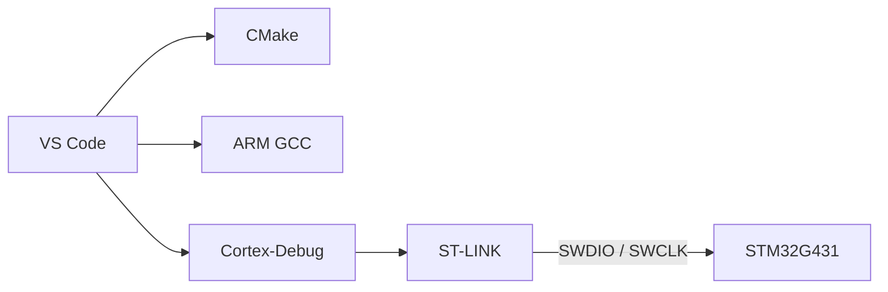

The repository includes `STM32G431.svd`, which lets debugging tools show MCU peripheral and register-level inspection.

### Development philosophy

G4_Core_Lib is intentionally developed without a generated framework defining the whole architecture. The goal is to understand and control the underlying system from the bottom up:

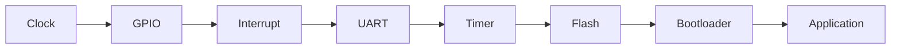

This makes the project suitable both as a reusable library and as a foundation for deeper embedded firmware development.

---

## Current Status

G4_Core_Lib is an **actively developing project**.

### Established

| Area | Item | Status |
|------|------|--------|
| Foundation | STM32G431 project foundation, CMSIS-based development | ✅ |
| Build | CMake build system, Ninja workflow, VS Code workflow | ✅ |
| Build | Separate Bootloader / Main configurations, application linker and memory separation | ✅ |
| Structure | BSP structure, configuration layer | ✅ |
| Drivers | GPIO abstraction, system clock module, TimeCore software timing | ✅ |
| UART | UART framework, interrupt-driven reception, ring-buffer reception | ✅ |
| Services | Logger / debug service | ✅ |
| Flash | Flash abstraction, erase / program / verify, CRC-based integrity checking | ✅ |
| Bootloader | Architecture, firmware update protocol, metadata handling | ✅ |
| Bootloader | Application validation, bootloader-to-application jump | ✅ |
| Host | Python command-line updater (`firmware_update_test.py`) | ✅ |

### In development

- [ ] Additional reusable peripheral drivers
- [ ] Broader HAL portability
- [ ] USB support
- [ ] Additional firmware update transports (USB, CAN, OTA)
- [ ] More extensive application validation
- [ ] Power-loss / interrupted-update testing
- [ ] Firmware authentication / secure update mechanisms
- [ ] Universal Firmware Updater PC application
- [ ] Automated and host-side testing
- [ ] API documentation

---

## Roadmap

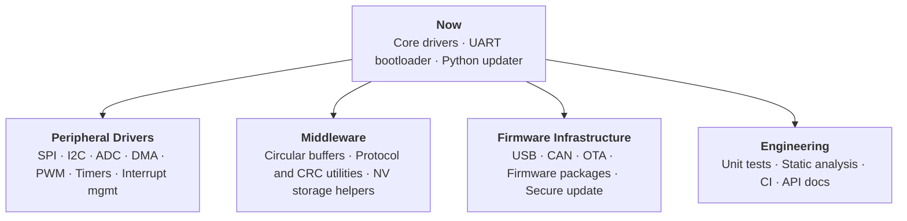

<details>
<summary><b>Detailed roadmap</b></summary>

**Peripheral drivers**
- UART improvements, SPI, I2C, ADC, DMA, PWM
- Additional timer functionality
- Interrupt management

**Middleware / utilities**
- Circular buffers and data structures
- Protocol utilities and CRC utilities
- Non-volatile storage helpers
- Additional reusable system services

**Firmware infrastructure**
- USB communication and USB-based firmware update
- CAN-based firmware update
- OTA update infrastructure
- Firmware package handling
- Improved application validation
- Firmware authentication and secure firmware update architecture

**Engineering infrastructure**
- Unit testing and host-side testing
- Automated build validation
- Static analysis
- API documentation
- Improved cross-project portability

</details>

### Future direction

The project is evolving from a peripheral abstraction library into a broader **embedded firmware platform**.

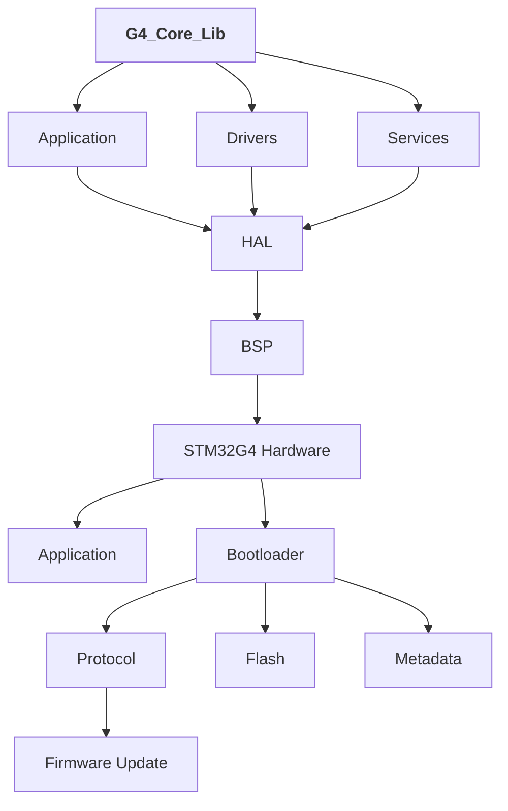

The long-term goal is to make the same core architecture usable across multiple STM32 embedded projects while keeping hardware-specific implementation isolated and replaceable.

---

## Target Applications

| Domain | Examples |
|--------|----------|
| Motor control | BLDC / FOC development, ESC firmware |
| Robotics and industrial | Robotics, industrial control |
| Measurement | Data acquisition, sensor interfaces, embedded test equipment |
| Power | Power electronics |
| Firmware | Embedded firmware, firmware update systems |
| R&D | STM32-based R&D platforms |

---

## Author

**Engr. Shohanur Rahman**
Embedded Software & Hardware Engineer
Firmware · PCB Hardware · Motor Control · Power Electronics

[](https://github.com/shohanur00)
[](https://www.linkedin.com/in/engr-shohanur-rahman-181a69250/)

## License

This project is currently under active development. License information will be added as the project matures.

---

<div align="center">

**G4_Core_Lib**

*Building reusable embedded firmware from the hardware layer up.*

</div>
